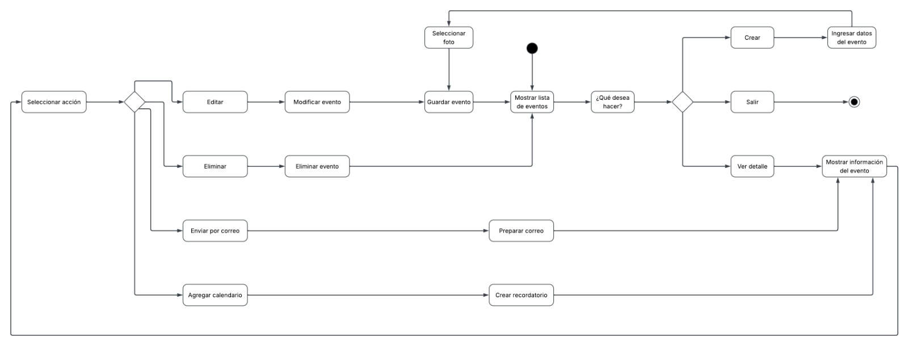
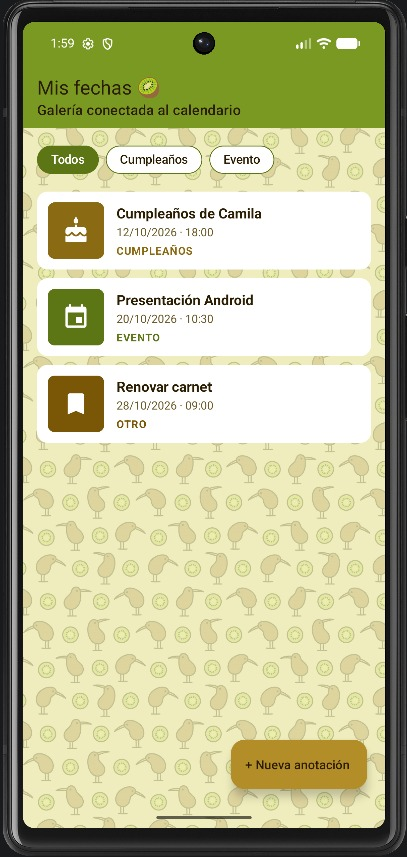
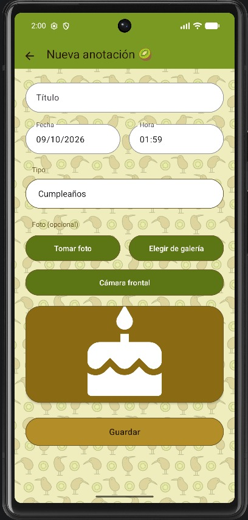
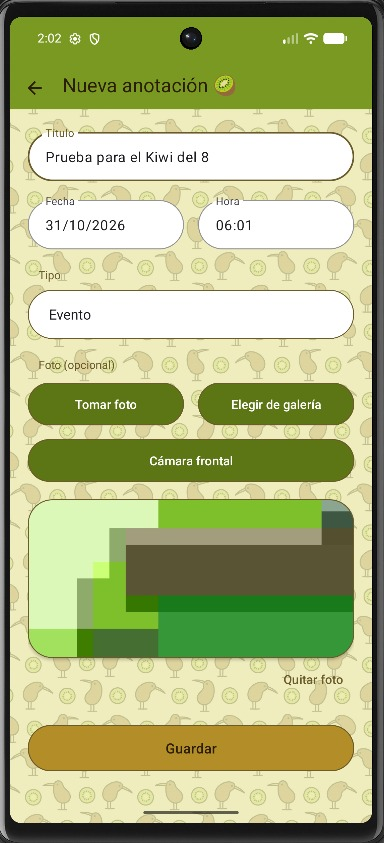
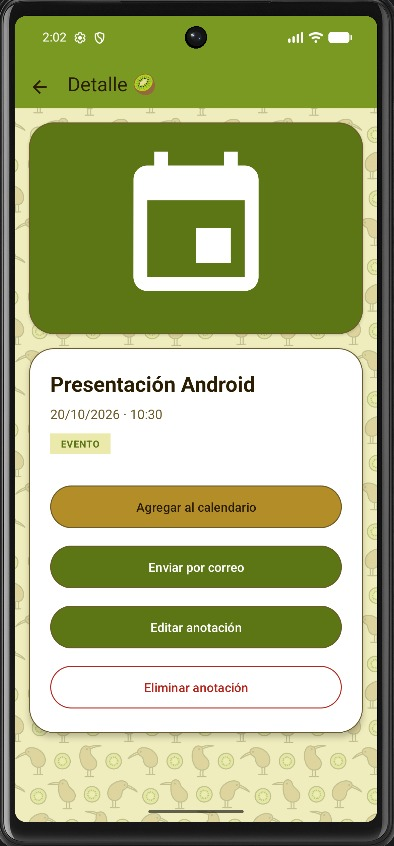
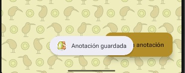
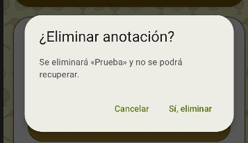
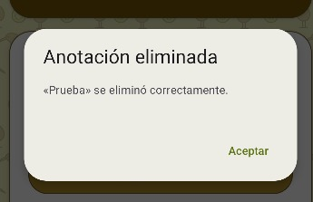

# 📅 AgendaEventos — Galería conectada al calendario

> Prototipo 2 · Programación Android · IP Santo Tomás
> App para anotar fechas importantes (cumpleaños, eventos y otros), adjuntarles una foto y enviarlas al calendario o por correo.

| 🎓 Carrera | 👨‍🏫 Docente | 🕖 Jornada |
|---|---|---|
| Analista Programador | Pedro Gatica | Vespertino |

---

## 👥 Equipo

| Integrante | Parte del proyecto |
|---|---|
| Yeimy Morales | 🏗️ Proyecto base, `MainActivity` (lista + filtros), explícito 1 y broadcasts (explícitos 8 y 13) |
| Milena Escobar | 📝 `FormActivity`: crear/editar, cámara, cámara frontal, galería y permisos (implícitos 5, 6 y 10) |
| Benjamín Ahumada | 🔎 `DetalleActivity` y `PhotoActivity`: calendario, correo, editar con resultado y foto completa (implícitos 4 y 8, explícitos 4 y 6) |

---

## 📝 Resumen

**AgendaEventos** permite:

- 📋 Ver todas las anotaciones en una lista con **filtros** (Todos / Cumpleaños / Evento).
- ➕ Crear y ✏️ editar anotaciones con título, fecha, hora y tipo.
- 📷 Adjuntar una foto con la **cámara trasera, la cámara frontal o la galería** (si no hay foto, se usa una imagen predeterminada según el tipo).
- 🗓️ Agregar la anotación al **calendario** del teléfono.
- ✉️ Enviarla por **correo** con la foto adjunta.
- 🔍 Ver la foto a pantalla completa.
- 🗑️ Eliminar anotaciones con confirmación.
- 🔔 Refrescar la lista automáticamente mediante **broadcasts internos** al guardar o eliminar.

---

## ⚙️ Versiones y tecnologías

| Elemento | Versión |
|---|---|
| Lenguaje | ☕ Java 11 |
| Android Gradle Plugin (AGP) | 9.0.1 |
| compileSdk | 36.1 |
| targetSdk | 36 (Android 16) |
| minSdk | 31 (Android 12) |
| Configuración de Gradle | Kotlin DSL (`build.gradle.kts`) |
| Diseño | Material Design 3 · temática kiwi (verde y dorado) |
| Librerías | AppCompat, Material, Activity, ConstraintLayout, LocalBroadcastManager |

---

## 🧭 Mapa de navegación

```
                    ┌──────────────────────┐
                    │     MainActivity     │  ◄── broadcasts (8 y 13) refrescan la lista
                    │  lista + filtros     │
                    └───────┬──────┬───────┘
       Explícito 1 (extras) │      │ Explícito (botón "+ Nueva anotación")
                            ▼      ▼
              ┌─────────────────┐  ┌─────────────────┐
              │ DetalleActivity │  │  FormActivity   │──► 📷 Cámara / 🤳 Cámara frontal / 🖼️ Galería
              └──┬──────┬───┬───┘  └─────────────────┘
                 │      │   │            ▲
  🗓️ Calendario ◄┘      │   └────────────┘ Explícito 4 (editar, con resultado)
  ✉️ Correo ◄───────────┤
                        ▼ Explícito 6 (URI de la foto)
                 ┌─────────────────┐
                 │  PhotoActivity  │
                 └─────────────────┘
```

---

## 🔄 Diagrama de actividades

Flujo completo del usuario: desde la lista de eventos puede **crear**, **ver el detalle** o **salir**. Desde el detalle puede **editar**, **eliminar**, **enviar por correo** o **agregar al calendario**, y siempre vuelve a la lista o al detalle.



---

## 🚀 Intents implementados

### 🌐 Implícitos (abren otras apps)

| N° | Intent | Acción | Dónde | 🧪 Cómo probarlo |
|---|---|---|---|---|
| 4 | ✉️ Enviar correo | `ACTION_SEND` + `message/rfc822` (con foto adjunta vía `FileProvider`) | `DetalleActivity` | Abrir una anotación → **Enviar por correo** → elegir la app de correo. Se prellenan asunto, cuerpo y foto. |
| 5 | 📷 Tomar fotografía | `MediaStore.ACTION_IMAGE_CAPTURE` | `FormActivity` | **+ Nueva anotación** → **Tomar foto** → aceptar el permiso → tomar la foto. Aparece en la vista previa. |
| 6 | 🖼️ Elegir imagen de galería | `ACTION_GET_CONTENT` con `image/*` (`ActivityResultContracts.GetContent`) | `FormActivity` | **+ Nueva anotación** → **Elegir de galería** → seleccionar una imagen. Se muestra en el `ImageView`. |
| 8 | 🗓️ Agregar evento al calendario | `Intent.ACTION_INSERT` con `Events.CONTENT_URI` | `DetalleActivity` | Abrir una anotación → **Agregar al calendario**. Se abre el calendario con título, fecha y hora rellenados. |
| 10 | 🤳 Cámara frontal | `ACTION_IMAGE_CAPTURE` con extras de cámara frontal (verifica `FEATURE_CAMERA_FRONT`) | `FormActivity` | **+ Nueva anotación** → **Cámara frontal**. Si el equipo no tiene cámara frontal, se avisa con un mensaje. |

### 🏠 Explícitos (dentro de la app)

| N° | Intent | Desde → Hacia | 🧪 Cómo probarlo |
|---|---|---|---|
| 1 | Mostrar detalle con datos extra (`putExtra`) | `MainActivity` → `DetalleActivity` | Tocar cualquier tarjeta de la lista. El detalle muestra título, fecha, hora, tipo y foto recibidos como extras. |
| 4 | Enviar datos y recibir respuesta (`registerForActivityResult`) | `DetalleActivity` → `FormActivity` (modo edición) | Abrir una anotación → **Editar** → cambiar el título → **Guardar cambios**. Al volver, el detalle se actualiza con el resultado. |
| 6 | Enviar la URI de la foto | `DetalleActivity` → `PhotoActivity` | Abrir una anotación con foto → tocar la imagen. Se muestra a pantalla completa. |
| 8 | Broadcast interno (`sendBroadcast` + `BroadcastReceiver`) | `DetalleActivity` → `MainActivity` | Abrir una anotación → **Eliminar** → **Sí** → **Aceptar**. Aparece el aviso «Anotación eliminada» y la lista se actualiza sola. |
| 13 | Mensaje con `LocalBroadcastManager` | `FormActivity` → `MainActivity` | Crear una anotación → **Guardar**. Aparece «Anotación guardada» y la lista se actualiza sin reabrir la pantalla. |

---

## ✅ Validaciones y manejo de errores

- 📝 Título obligatorio y con largo máximo de 60 caracteres.
- 📆 Fecha y hora deben existir (por ejemplo, no se acepta 31/02).
- ✏️ Al editar, se avisa si no hubo cambios.
- 🔐 **Permisos** de cámara y galería pedidos en tiempo de ejecución; si se bloquean, se ofrece abrir **Ajustes**.
- 🤳 Se verifica que el equipo tenga cámara frontal.
- 📲 `try/catch` con `ActivityNotFoundException` cuando no hay una app para el intent implícito.
- 🖼️ Si la foto ya no existe, se muestra la imagen predeterminada del tipo.
- 🚫 Validación de extras nulos en `DetalleActivity` y `PhotoActivity`.
- 🗑️ Doble confirmación antes de eliminar.

## 🧵 Threads

Las fotos se **reducen y guardan en segundo plano** con un `ExecutorService` (`Executors.newSingleThreadExecutor()`), y la pantalla se actualiza con `runOnUiThread()`. Así la app no se congela al procesar imágenes grandes.

---

## 🗂️ Estructura del proyecto

```
com.ageneven.agendaeventos
├── MainActivity        → lista, filtros y receptores de broadcasts
├── FormActivity        → crear / editar, cámara y galería
├── DetalleActivity     → detalle, calendario, correo, editar y eliminar
├── PhotoActivity       → foto a pantalla completa
├── adapter/EventoAdapter     → RecyclerView.Adapter de las tarjetas
├── data/EventoRepositorio    → datos en memoria (patrón Singleton)
├── model/Evento              → modelo de datos (encapsulamiento)
└── util/Constantes, ImagenUtil
```

---

## 🌿 Trabajo con Git

- `main` → rama principal.
- `feature/intents` → rama de trabajo del equipo.
- Ramas personales: `feature/main-activity`, `Form-Activity`, `DetalleActivity`, integradas mediante **Pull Requests**.

---

## 📸 Capturas

### Pantallas principales

| Lista con filtros | Nueva anotación | Foto adjunta | Detalle |
|:---:|:---:|:---:|:---:|
|  |  |  |  |
| Explícito 1 → al tocar una tarjeta | Imagen predeterminada según el tipo | Implícitos 5, 6 y 10 | Implícitos 4 y 8, explícitos 4 y 6 |

### Avisos y validaciones

| Anotación guardada | Confirmar eliminación | Anotación eliminada |
|:---:|:---:|:---:|
|  |  |  |
| Explícito 13 · LocalBroadcastManager | Doble confirmación | Explícito 8 · sendBroadcast |

---|---|---|---|
|  |  |  |  |
-->

_Capturas de la app funcionando: lista principal, formulario, detalle y aviso de broadcast._

---

## 🛠️ Cómo compilar y ejecutar

1. Clonar el repositorio:
   ```bash
   git clone https://github.com/Nainali-Pixel/Evaluacion-2---App-Galeria---Calendario-Eventos.git
   ```
2. Abrir la carpeta en **Android Studio** y esperar la sincronización de Gradle.
3. Conectar un teléfono con **Depuración USB** activada (Android 12 o superior) o iniciar un emulador.
4. Presionar ▶️ **Run 'app'**.

### 📦 APK debug

En Android Studio: **Build → Build App Bundle(s) / APK(s) → Build APK(s)**.
El archivo queda en:
```
app/build/outputs/apk/debug/app-debug.apk
```
